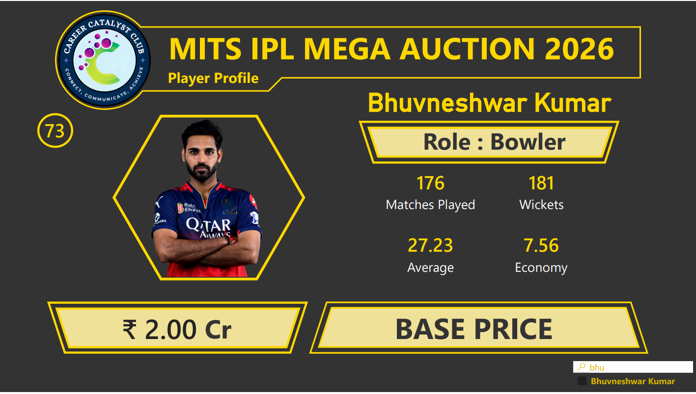

# 🏏 MITS IPL Mega Auction 2026 Dashboard

## 📌 Overview

This Power BI dashboard was developed for the MITS IPL Mega Auction 2026 to support player evaluation, performance analysis, and auction decision-making.

The dashboard combines player statistics and auction-related information into an interactive platform that helps stakeholders assess player value before and during the auction process.

---

## 📊 Dashboard Preview

---

## 🎯 Project Objective

Player auctions involve evaluating numerous athletes across different roles and performance metrics while considering budget constraints.

This dashboard was designed to answer key questions such as:

- Which players offer the best performance value?
- How do players compare across different roles?
- Which bowlers, batters, or all-rounders have the strongest records?
- How does player performance align with auction pricing?
- Which players represent the most cost-effective auction targets?

---

## 📈 Player Evaluation Metrics

The dashboard provides detailed player-level analysis using metrics such as:

- Matches Played
- Runs Scored
- Wickets Taken
- Batting Average
- Bowling Average
- Strike Rate
- Economy Rate
- Base Price
- Player Role

---

## 🔍 Key Insights

### 🏏 Player Profiling

- Built individual player profiles for quick performance assessment.
- Consolidated key career statistics into a single analytical view.

### 💰 Auction Strategy

- Integrated player pricing information to support bidding decisions.
- Enabled comparison between player cost and historical performance.

### 📊 Performance Analysis

- Evaluated players using role-specific performance metrics.
- Supported identification of high-impact players across categories.

### 🔎 Interactive Exploration

- Dynamic filtering allows instant player selection and comparison.
- Search functionality improves accessibility during live auction events.

---

## 📊 Dashboard Features

- Dynamic Player Search
- Individual Player Profiles
- Auction Price Tracking
- Performance Metric Analysis
- Role-Based Filtering
- Interactive KPI Cards
- Cricket Analytics Visualizations
- Decision Support Dashboard

---

## 🛠 Tools & Technologies

- Power BI
- DAX
- Power Query
- Data Modeling
- Sports Analytics

---

## 💡 Applications

This dashboard can be used for:

- Cricket Auction Management
- Team Selection Strategy
- Player Performance Analysis
- Budget Planning
- Sports Analytics Projects
- Decision Support Systems

---

## 📂 Repository Contents

| File | Description |
|--------|-------------|
| MITS-IPL-Mega-Auction-2026-Dashboard.pbix | Power BI dashboard |
| IPL-Auction-Player-Dataset.xlsx | Player statistics dataset |
| IPL-Auction-Player-Profile.pdf | Dashboard report |
| dashboard-overview.png | Dashboard preview image |

---

### Author

**Medhavi Agrawal**  
Aspiring Data Analyst | Power BI | SQL | Excel
